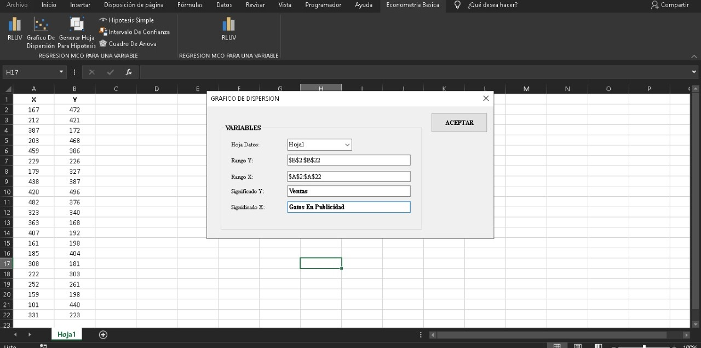
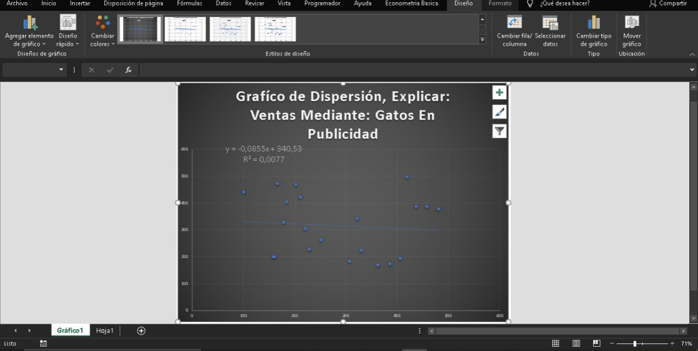
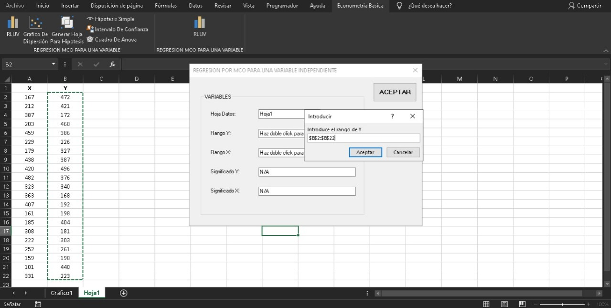
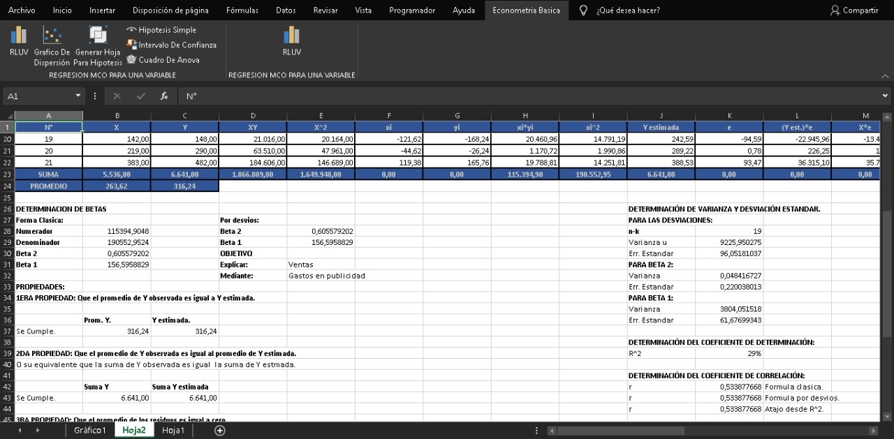
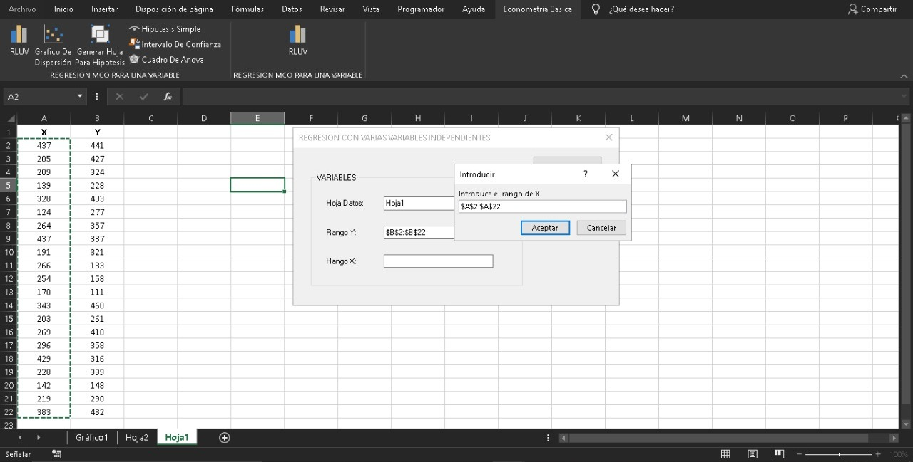
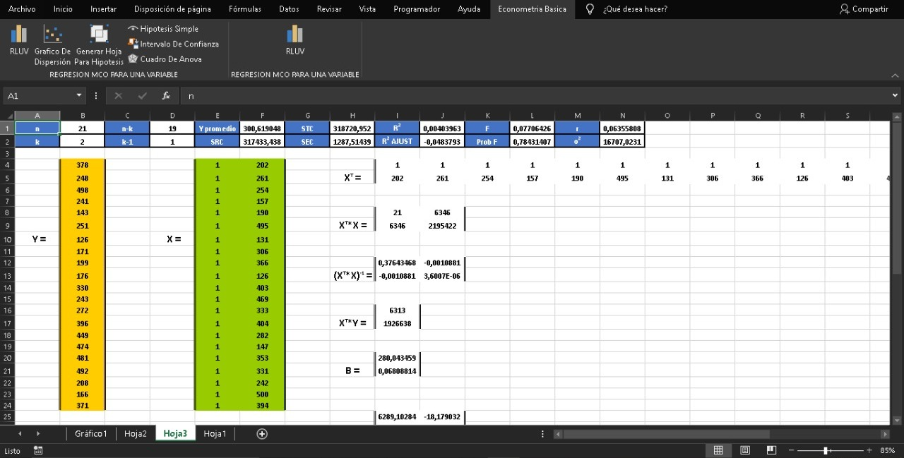

<div class="my-post-main-container">

<!-- ################  CONFIGURACIONES ###################### -->

```{r include=FALSE}
knitr::opts_chunk$set(echo = TRUE,
                      message = FALSE,
                      warning = FALSE,
                      out.width = "60%",
                      out.height = "60%",
                      fig.align = "center")

```


El presente complemento de Excel permite hacer gráficos de dispersión, regresiones por el método de mínimos cuadrados ordinarios (MCO), tanto para una variable independiente o para varias variables independientes, también puede realizarse hipótesis sobre los modelos resultantes, así como los intervalos de confianza de las estimaciones y cuadros ANOVA, dicho complemento esta desarrollado en VBA.NET

## Descargar

Para instalar el complemento en su pc solo debe descargar la carpeta [publish](https://github.com/LASPUMSS/COMPLEMENTO-DE-ECONOMETRIA-BASICA/tree/master/publish) y ejecutar el archivo setup.exe.

Si hacemos alguna actualización al complemento igualmente lo podrán encontrar en el enlace anterior, en su repositorio de GitHub.

## Grafico De Dispersión

Introduce los datos correspondientes:

```{r, echo=FALSE}

```


Y se generan los gráficos de dispersión:

```{r, echo=FALSE}

```


## Regresión Por MCO A Una Variable Independiente

Introducir los datos correspondientes:

```{r, echo=FALSE}

```


Y se genera la regresión por MCO :

```{r, echo=FALSE}

```

## Regresión Por MCO A Varias Variables Independientes

Introducir los datos correspondientes:

```{r, echo=FALSE}

```


Y se genera la regresión por MCO :

```{r, echo=FALSE}

```


## Ver tambien

- [Video tutorial de instalación del complemento.](https://www.youtube.com/watch?v=ScUamAx84BM&t=66s)

- [Video tutorial de uso del complemento.](https://www.youtube.com/watch?v=gi7kvmdvpas)


</div>